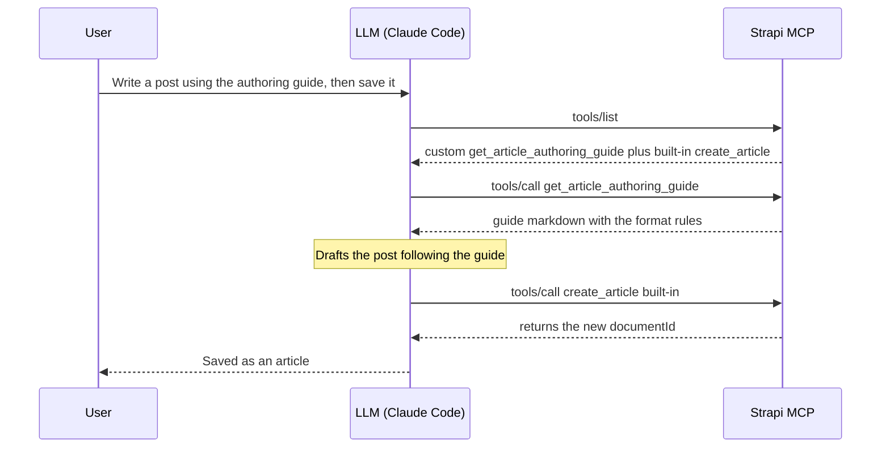

**TL;DR**

- Strapi 5.47+ ships an MCP server **built in**. You enable it with one line in `config/server.ts`, point an MCP client (Claude Code, Cursor, Windsurf) at `/mcp`, and you immediately get CRUD tools for every content type, gated by the admin token's permissions.
- The out-of-the-box CRUD tools cover content types. **They do not cover custom controllers, custom workflows, or anything that isn't a plain entity.** That's where custom tools come in.
- You can call `strapi.ai.mcp.registerTool(...)` from anywhere in the `register()` phase, but wrapping that in a **plugin** makes the work shareable, versionable, and gives a clean folder structure once you have more than one tool.
- For a multi-step workflow, add a custom `get_*_guide` tool for your format rules and let the model save with the **built-in** content-type tools.
- The reference implementation lives in [this example project](https://github.com/PaulBratslavsky/strapi-mcp-demo-and-tool-extension): the plugin, the full folder layout, and a long-term proposal for upstream Strapi.

## What is MCP, and why does it matter?

The [Model Context Protocol](https://modelcontextprotocol.io/) is an open standard for letting LLMs talk to external systems. Think of it as USB-C for AI: any MCP-compatible client (Claude Code, Claude Desktop, Cursor, Windsurf, Gemini CLI, …) can connect to any MCP-compatible server (Strapi, GitHub, Linear, Sentry, …) without bespoke glue code.


A server can expose three kinds of capability: **tools**, **resources**, and **prompts**. It can also send a block of **instructions** when a client connects. That last one is a field on the connection response, not a separate capability, but it acts like a fourth option.

The difference that matters: some of these the model picks up and uses on its own, and some only run when the human clicks them. That difference decides which one to use for a custom workflow.

| Primitive | Discovery | Auto-loaded by the LLM? |
|---|---|---|
| **Tools** | `tools/list` — model-controlled | ✅ Yes — the LLM decides when to call |
| **Prompts** | `prompts/list` — user-triggered slash commands | ❌ Only when the user explicitly invokes them |
| **Resources** | `resources/list` — application-controlled | ⚠️ Client-dependent (Claude Code does **not** auto-fetch) |
| **Server Instructions** | `initialize` response | ✅ Yes — injected into the system prompt at connection |

The "auto-loaded" column is the one to watch. It decides whether the model uses a capability on its own or waits for the user to trigger it.

Out of the box, Strapi fills only one of those rows: it auto-derives **tools** from your content types. It registers no prompts or resources by default, and it sends no server instructions. So on a fresh Strapi, tools are the whole surface.

## Before you begin

You need a Strapi v5 project on 5.47.0 or later. That is when the built-in MCP server [shipped, as a Beta feature](https://docs.strapi.io/cms/features/strapi-mcp-server). The examples here count `article`, `author`, and `category` entries, so the project needs those content types with some data in them.


`create-strapi-app --example` sets up exactly that: the blog content types with sample entries already loaded (5 articles, 2 authors, 5 categories). `--skip-cloud` and `--non-interactive` skip the Cloud-account and setup prompts (it defaults to SQLite and TypeScript).

```bash
npx create-strapi-app@latest my-app --example --skip-cloud --non-interactive
cd my-app
npm run develop
```

Create your first **Admin User**:


Then just make sure to publish example content:


This is a clean project, so you add MCP and build the custom tools yourself by following along. The [finished version](https://github.com/PaulBratslavsky/strapi-mcp-demo-and-tool-extension) (this post's example repo, with MCP and the plugin already wired up) is there to compare against. Already have a Strapi 5.47+ project? Use it, and put your own content types in place of `article`/`author`/`category`.

## Shortcut: just want it set up? Use the skill

If you only want a working MCP server and a custom tool in **your own project** — and don't need the step-by-step understanding — the example repo ships a Claude Code skill, [`setup-strapi-mcp`](https://github.com/PaulBratslavsky/strapi-mcp-demo-and-tool-extension/tree/main/.claude/skills/setup-strapi-mcp), that does the whole setup for you. It works on any Strapi v5 project on 5.47+, not just this example. Here is the full walk-through:

**1. Get the skill into your project.** Copy the `setup-strapi-mcp/` folder out of the example repo into your own project's `.claude/skills/` directory (Claude Code loads skills from there). Put it in `~/.claude/skills/` instead if you want it available in every project on your machine.

```bash
# from your Strapi project root
mkdir -p .claude/skills
cp -R /path/to/strapi-mcp-demo-and-tool-extension/.claude/skills/setup-strapi-mcp .claude/skills/
```

**2. Open your project in Claude Code and run it.** Just say *"set up strapi mcp"*. The skill first checks you are on Strapi 5.47+, then asks whether to register the example tool **inline** (`src/index.ts`), as a **plugin**, or **both** — pick whichever you want (both is a good way to see the difference).

**3. Let it scaffold.** It enables the MCP server in `config/server.ts`, writes the example tool(s), and — on the plugin path — registers a grantable admin permission and builds the plugin. It also tells you exactly what it changed.

**4. Finish in the admin (the one manual part).** Create an **Admin Token** at *Settings → Admin Tokens*, grant the plugin tool's permission on the token's **Plugins** tab, then point your MCP client at `http://localhost:1337/mcp` with that token (see [Connect from Claude Code](#connect-from-claude-code) below).

That is the fast path, done. The rest of this post builds the same thing by hand — reach for the walkthrough below when you want to understand every moving part, not just get the scaffold.

## Step 1: Turn on the built-in MCP server

The server is off by default. **Edit `config/server.ts`** and add the `mcp` key, keeping the existing `host`, `port`, and `app` keys:

```ts
// config/server.ts
import type { Core } from '@strapi/strapi';

export default ({ env }: Core.Config.Shared.ConfigParams): Core.Config.Server => ({
  host: env('HOST', '0.0.0.0'),
  port: env.int('PORT', 1337),
  app: { keys: env.array('APP_KEYS') },
  mcp: { enabled: true },          // ← that's the whole thing
});
```

Restart Strapi. The MCP endpoint is now live at `http://localhost:1337/mcp`.

> To tune the transport timeouts (`connectTimeoutMs`, `requestTimeoutMs`), see [Advanced options](https://docs.strapi.io/cms/features/strapi-mcp-server#advanced-options).

### Heads-up #1: the right token

The MCP server uses **Admin API Tokens**, not Content API Tokens. These are two different permission systems, not the same screen in two places. A Content API token grants per-controller-action access (check `find`, `create`, and so on for each content type). An Admin token uses Strapi's role-based access control (RBAC): it inherits what its owner's admin roles allow. They live under different menus:

- ❌ **Settings → API Tokens**: these are for the Content API (`/api/...`). MCP rejects them with a 401.
- ✅ **Settings → Admin Tokens**: this is the one MCP accepts.

Give the Admin token the **least** access it needs, and add permissions as you go. This is the opposite of the usual "Full Access for local dev" habit, and the reason is specific to MCP: every content-type permission you enable turns into a set of MCP tools (up to about six per content type: `list`, `get`, `create`, `update`, `delete`, `publish`). 


Enable everything across, say, ten content types and the client sees roughly sixty tools, each with a full schema. All of that lands in the model's context before it does any work. A narrow token keeps the tool list short and the context focused on what the workflow actually touches. ("Full Access" in one click is really a Content API token idea; for Admin tokens, scope deliberately.) The token value is shown only once, so copy it as soon as it appears.

### Heads-up #2: the token decides which tools appear

The built-in tools you can use depend on the token's permissions (custom tools come later). A read-only token shows only the `list_*` and `get_*` tools. 

A token with write access also shows create, update, delete, and publish. You can't see more tools than the token allows; the docs cover this under [Permission boundaries](https://docs.strapi.io/cms/features/strapi-mcp-server#permission-boundaries).

Copy your token so you can use it to connect to Claude Code, Claude desktop or any other platform.


### Connect from Claude Code

Any MCP client needs the same three settings, whatever its config format:

- **URL**: `http://localhost:1337/mcp`
- **Transport**: `streamable-http`
- **Auth**: an `Authorization: Bearer <admin token>` header

The rest is client-specific. For Claude Code, following the [Connecting Claude Code](https://docs.strapi.io/cms/features/strapi-mcp-server#connecting-claude-code) doc:

```bash
claude mcp add strapi-mcp --transport http http://localhost:1337/mcp \
  -H "Authorization: Bearer YOUR_ADMIN_TOKEN"
```

Start a new Claude Code session and run `/mcp`. It should show `strapi-mcp ✓ Connected`. Now you can ask things like *"list the 3 most recent articles"* and the built-in tools answer.

**Claude Desktop** doesn't speak `streamable-http` directly, so it connects through the `mcp-remote` bridge. Add this to `claude_desktop_config.json` (macOS: `~/Library/Application Support/Claude/`, Windows: `%APPDATA%\Claude\`) and restart Desktop:

```json
{
  "mcpServers": {
    "strapi-mcp": {
      "command": "npx",
      "args": [
        "-y", "mcp-remote", "http://localhost:1337/mcp",
        "--header", "Authorization: Bearer YOUR_ADMIN_TOKEN"
      ]
    }
  }
}
```

Cursor and Windsurf have their own config formats; the [AI client configuration](https://docs.strapi.io/cms/features/strapi-mcp-server#ai-client-configuration) docs cover all four.

I will be testing in Claude Desktop. Once I enable the connector, I am able to ask "What tools does my Strapi MCP have?" 


## Step 2: When the built-in tools aren't enough

For every content type, the built-in MCP server creates a set of tools automatically: `list`, `get`, `create`, `update`, `delete`, plus `publish`, `unpublish`, and `discard_draft` when Draft & Publish is on. The full list is in the [Content-type tools](https://docs.strapi.io/cms/features/strapi-mcp-server#content-type-tools) docs. This covers reading and writing entries.

It does not cover anything you wrote by hand: a custom controller, an aggregation, a computed view, a multi-step flow. If you have a `src/api/<thing>/controllers/<thing>.ts` with your own logic in it, the MCP server has no tool for it.

Let's build our first custom tool: one that reports how much content the project has, counting published articles, authors, and categories. No built-in tool does that aggregation, so we write the logic ourselves and then hand it to the model.

We'll set it up as a normal Strapi API endpoint: three small files under `src/api/stats/`, created one at a time.

**Create `src/api/stats/services/stats.ts`** — the service holds the logic:

```ts
// src/api/stats/services/stats.ts
export default {
  async overview() {
    const [articles, authors, categories] = await Promise.all([
      strapi.documents('api::article.article').count({ status: 'published' }),
      strapi.documents('api::author.author').count({}),
      strapi.documents('api::category.category').count({}),
    ]);
    return { articles, authors, categories };
  },
};
```

**Create `src/api/stats/controllers/stats.ts`** — a thin HTTP layer that calls the service:

```ts
// src/api/stats/controllers/stats.ts
export default {
  async index(ctx) {
    ctx.body = await strapi.service('api::stats.stats').overview();
  },
};
```

**Create `src/api/stats/routes/stats.ts`** — this mounts the controller at `GET /api/stats`:

```ts
// src/api/stats/routes/stats.ts
export default {
  routes: [
    {
      method: 'GET',
      path: '/stats',
      handler: 'stats.index',
      config: { policies: [], middlewares: [] },
    },
  ],
};
```

Restart Strapi. The route is mounted at `GET /api/stats` and the service is registered as `api::stats.stats`. Like any Strapi route, `/api/stats` is protected, so to call it over REST you grant the Public role or use an API token. The MCP tool doesn't need that; it calls the `api::stats.stats` service directly.

**Service or controller: which does the MCP tool call?** The service. The two layers do different jobs:

- A **service** is the logic. Call it from anywhere with `strapi.service('api::stats.stats').overview()` and it returns a plain value.
- A **controller** is the HTTP layer. It takes the request context (`ctx`), and on the way out it **sanitizes** the response: it strips private fields and relations the caller is not allowed to see, based on the content-type schema and the request's permissions. The [controllers docs](https://docs.strapi.io/cms/backend-customization/controllers) cover `sanitizeOutput`, `sanitizeInput`, and `validateQuery`.

An MCP tool handler is not an HTTP request, so it calls the service directly and skips that sanitization. For `stats` that is fine, since the result is just counts (nothing to leak). But a tool that returns entity data, say article rows, would return them raw, including fields the token should not see. There you sanitize before returning, with `strapi.contentAPI.sanitize.output(...)` and the caller's permissions (the handler is handed `context.userAbility`). The built-in content-type tools already sanitize; a hand-written tool does not unless you add it.

None of the built-in MCP tools know `api::stats.stats` exists, so the next step registers a custom tool that calls it.

## Step 3: Register a custom tool

The function to call is `strapi.ai.mcp.registerTool({...})`; the [Plugin API](https://docs.strapi.io/cms/features/strapi-mcp-server#plugin-api) section is the entry point. Two rules matter before you start:

- **Register before the MCP server starts.** Strapi locks the tool list at startup, and the start happens at a specific point in the boot order: plugin `register()` → plugin `bootstrap()` → MCP server starts → app `bootstrap()` (your `src/index.ts`). So from inside a plugin you can register in either `register()` or `bootstrap()`. From the app's own `src/index.ts`, only `register()` is early enough; registering in `src/index.ts` `bootstrap()` runs after the server has started and throws. `register()` is the cleanest place. `bootstrap()` runs later, after Strapi's services (the document service, the database) are fully ready, so register there if your tool's setup needs them at registration time. (The tool's `createHandler` always runs at request time, so handlers have full service access either way.) Strapi clarified this registration lifecycle in [PR #26517](https://github.com/strapi/strapi/pull/26517).
- **Required fields are `name`, `title`, `description`, `resolveOutputSchema`, and either `auth` or `devModeOnly`.** `resolveInputSchema` is optional; leave it out for a tool that takes no arguments. The schema fields are functions, not plain objects. Strapi calls them on each request and passes the caller's permissions (`context.userAbility`), so a tool can return a narrower schema for a less-privileged token. The `z` you build the schema with (Strapi's bundled copy of [Zod](https://github.com/colinhacks/zod)) has to come from `@strapi/utils`, not the `zod` package directly.

**Edit `src/index.ts`** and register the tool in the app's `register()` hook. Here is the smallest working version:

```ts
// src/index.ts
import type { Core } from '@strapi/strapi';
import { z } from '@strapi/utils';

export default {
  async register({ strapi }: { strapi: Core.Strapi }) {
    if (!strapi.ai.mcp.isEnabled()) return;

    // Register an admin permission so the tool can be granted per token.
    // An app isn't a plugin, so it goes under `section: 'settings'`; the
    // action id comes out as `api::stats-overview.read`.
    await strapi.service('admin::permission').actionProvider.registerMany([
      { section: 'settings', category: 'MCP', displayName: 'Read content stats overview', uid: 'stats-overview.read' },
    ]);

    strapi.ai.mcp.registerTool({
      name: 'get_stats_overview',
      title: 'Get content stats overview',
      description: 'Return aggregate counts of published articles, authors, and categories.',
      resolveOutputSchema: () =>
        z.object({
          articles: z.number().int().nonnegative(),
          authors: z.number().int().nonnegative(),
          categories: z.number().int().nonnegative(),
        }),
      auth: { policies: [{ action: 'api::stats-overview.read' }] },
      createHandler: (strapi) => async () => {
        const overview = await strapi.service('api::stats.stats').overview();
        return {
          content: [{ type: 'text', text: JSON.stringify(overview) }],
          structuredContent: overview,
        };
      },
    });
  },
  bootstrap() {},
};
```

`register()` does two things: it registers an admin permission, then the tool gated on it (`auth.policies` points at the `api::stats-overview.read` action it just registered). Restart Strapi, and that permission shows up under **Settings → Admin Tokens**, on a token's **Settings** tab, in an **MCP** group:


Check **Read content stats overview** and save, and that token can call the tool. Registering the tool's own permission is what gives the admin token fine-grained, per-tool control over it. That is a custom tool, start to finish, registered right in the app.


So why bother with a plugin?

## Step 4: Why we wrap this in a plugin

Registering tools directly in `src/index.ts` works. Plenty of small projects do exactly that. We chose a plugin instead, and the reasons add up once you have more than one or two tools:

- **It keeps the code in one place.** Everything MCP-related sits under `src/plugins/strapi-extended-mcp/`. None of it mixes into the app's own `src/index.ts` or `src/lib/`. Someone opening the project later sees the folder name and knows what is inside.
- **It is portable.** A Strapi plugin is a folder with a `package.json`. You can `npm publish` it, or copy it into another Strapi project, and every tool comes with it, already wired up. The other project does not have to touch its own `src/index.ts`.
- **It has room to grow.** Four tools, a couple of guide files, some shared helpers: the plugin's `server/src/` folder holds all of it, and the app root stays clean.
- **It has the right lifecycle hooks.** A plugin gets its own `register`, `bootstrap`, and `destroy` functions. Tool registration belongs in `register()`, and the plugin gives you that function directly.

The cost: after every source change you run `npm run build` inside the plugin folder, then restart Strapi. The plugin loads from its `dist/` folder (the `exports` field in its `package.json` points there), so an un-built change has no effect. To avoid the manual rebuild during development, run `strapi-plugin watch:link`.

## Step 5: Scaffold the plugin

```bash
mkdir -p src/plugins/strapi-extended-mcp
cd src/plugins/strapi-extended-mcp
npx @strapi/sdk-plugin@latest init .
```

Answer the prompts (plugin name `strapi-extended-mcp`, no admin panel UI needed for this case). 

``` bash
npx @strapi/sdk-plugin@latest init .
✔ plugin name … strapi-extended-mcp
✔ plugin id (used by Strapi) … strapi-extended-mcp
✔ plugin display name … Strapi MCP
✔ plugin description … Extend Strapi's native MCP with custom tools
✔ plugin author name … Paul Bratslavsky
✔ plugin author email … paul.bratslavsky@strapi.io
✔ git url … 
✔ plugin license … MIT
✔ register with the admin panel? … no
✔ register with the server? … yes
✔ Add .editorconfig? … yes
✔ Add ESLint configuration? … yes
✔ Add Prettier configuration? … yes
✔ Use TypeScript? … yes
```

Finally, **edit `config/plugins.ts`** to enable the plugin (merge with any existing entries):

```ts
// config/plugins.ts
import type { Core } from '@strapi/strapi';

const config = ({ env }: Core.Config.Shared.ConfigParams): Core.Config.Plugin => ({
  'strapi-extended-mcp': {
    enabled: true,
    resolve: './src/plugins/strapi-extended-mcp',
  },
});

export default config;

```

## Step 6: Build the plugin's MCP tools

The scaffold from Step 5 leaves a default plugin: `server/src/{register,bootstrap,destroy}.ts` plus `controllers/`, `services/`, `routes/`, `config/`, `content-types/`, `policies/`, and `middlewares/` stubs. **Leave those stubs in place** — the generated `server/src/index.ts` imports every one of them, so deleting any will break the build. You only *add* a new `server/src/mcp/` folder here (and replace `register.ts` in 6.9). We build it bottom-up, each file using the one before it:

```
server/src/
├── md-raw.d.ts          ← tells TypeScript a `*.md?raw` import is a string
├── register.ts          ← wires the permissions, then the tools, on boot
└── mcp/
    ├── types.ts         ← the shared tool type
    ├── permissions.ts   ← one admin action per tool
    ├── index.ts         ← registers every tool with strapi.ai.mcp
    ├── guides/
    │   └── article-authoring-guide.md   ← the guide content (human-edited), imported with ?raw
    └── tools/
        ├── index.ts                       ← the list of tools
        ├── list-recent-articles.ts        ← a read tool with input args
        └── get-article-authoring-guide.ts ← serves the bundled guide markdown
```

We build two tools here. The [example repo](https://github.com/PaulBratslavsky/strapi-mcp-demo-and-tool-extension) adds two more (`get_content_api_docs` and `get_extended_mcp_info`); each is the same shape.

**6.1 — Create `server/src/mcp/types.ts`**

This is the one shape every tool file exports, so the loader can treat them all the same:

```ts
// server/src/mcp/types.ts
import type { Core } from '@strapi/strapi';

export type RegisterTool = Core.Strapi['ai']['mcp']['registerTool'];

export type StrapiMcpToolModule = {
  register: (registerTool: RegisterTool, strapi: Core.Strapi) => void;
};
```

**6.2 — Create `server/src/mcp/permissions.ts`**

One admin action per tool, registered under `section: 'plugins'` so each becomes its own checkbox on an admin token's **Plugins** tab. (The inline tool in Step 3 did this at the app level, under `section: 'settings'`; a plugin's actions group under the plugin name instead.) Export the UIDs so each tool gates on its own:

```ts
// server/src/mcp/permissions.ts
import type { Core } from '@strapi/strapi';

const PLUGIN_NAME = 'strapi-extended-mcp';

const ACTION_DEFS = [
  { uid: 'articles.read', displayName: 'List recent articles' },
  { uid: 'guide.read',    displayName: 'Read the article authoring guide' },
];

export const MCP_ACTIONS = {
  ARTICLES_READ: `plugin::${PLUGIN_NAME}.articles.read`,
  GUIDE_READ:    `plugin::${PLUGIN_NAME}.guide.read`,
};

export const registerMcpPermissions = async (strapi: Core.Strapi) => {
  await strapi.service('admin::permission').actionProvider.registerMany(
    ACTION_DEFS.map((a) => ({ section: 'plugins', pluginName: PLUGIN_NAME, ...a }))
  );
  strapi.log.info(`[strapi-extended-mcp plugin] Registered ${ACTION_DEFS.length} custom admin permission(s).`);
};
```

**6.3 — Create `server/src/mcp/tools/list-recent-articles.ts`**

The first tool. Each tool implements `StrapiMcpToolModule` and gates on an action from `permissions.ts`. This one is a read tool that takes an optional `limit`:

```ts
// server/src/mcp/tools/list-recent-articles.ts
import { z } from "@strapi/utils";
import type { StrapiMcpToolModule } from "../types";
import { MCP_ACTIONS } from "../permissions";

const tool: StrapiMcpToolModule = {
  register(registerTool) {
    registerTool({
      name: "list_recent_articles",
      title: "List recent articles",
      description:
        "Return the most recently published articles, newest first. Supports an optional limit (default 5, max 25).",
      resolveInputSchema: () =>
        z.object({
          limit: z.number().int().min(1).max(25).optional(),
        }),
      resolveOutputSchema: () =>
        z.object({
          count: z.number().int().nonnegative(),
          articles: z.array(
            z.object({
              documentId: z.string(),
              title: z.string(),
              slug: z.string().nullable(),
              description: z.string().nullable(),
              author: z.string().nullable(),
              category: z.string().nullable(),
              publishedAt: z.string().nullable(),
            })
          ),
        }),
      auth: {
        policies: [{ action: MCP_ACTIONS.ARTICLES_READ }],
      },
      createHandler: (strapi) => async ({ args }) => {
        const limit = args?.limit ?? 5;
        const entries = await strapi
          .documents("api::article.article")
          .findMany({
            status: "published",
            sort: { publishedAt: "desc" },
            limit,
            populate: {
              author: { fields: ["name"] },
              category: { fields: ["name"] },
            },
            fields: ["title", "slug", "description", "publishedAt"],
          });

        const articles = entries.map((e: any) => ({
          documentId: e.documentId,
          title: e.title ?? "",
          slug: e.slug ?? null,
          description: e.description ?? null,
          author: e.author?.name ?? null,
          category: e.category?.name ?? null,
          publishedAt: e.publishedAt ? new Date(e.publishedAt).toISOString() : null,
        }));

        const payload = { count: articles.length, articles };
        return {
          content: [{ type: "text", text: JSON.stringify(payload) }],
          structuredContent: payload,
        };
      },
    });
  },
};

export default tool;
```

The second tool returns a **markdown guide**: your house format for articles, which the model reads before it writes. You want to keep that guide as a normal `.md` file you can edit. The catch is loading it at runtime: `@strapi/sdk-plugin` bundles the plugin into a single `dist/server/index.js` with vite, and vite leaves `.md` files out of that bundle, so the running plugin can't read the file off disk.

The fix is vite's `?raw` import. Adding `?raw` to an import path tells vite to read that file at build time and inline its contents into the bundle as a string. You keep one real `.md`, and get its text in code, with nothing to copy or keep in sync:

```ts
import guide from './guides/article-authoring-guide.md?raw';
// `guide` is the file's full text, as a string
```

**6.4 — Create `server/src/md-raw.d.ts`**

TypeScript doesn't know what a `?raw` import resolves to, so declare it once — any `*.md?raw` import is a string:

```ts
// server/src/md-raw.d.ts
declare module '*.md?raw' {
  const content: string;
  export default content;
}
```

**6.5 — Create `server/src/mcp/guides/article-authoring-guide.md`**

This is the guide content itself — plain markdown you can edit:

````md
# Article authoring guide

Write articles for this project's `article` content type, then save them with the
built-in `create_article` tool. An article has these fields:

| Field         | Type                 | Notes                                  |
| ------------- | -------------------- | -------------------------------------- |
| `title`       | string               | The headline.                          |
| `description` | text (max 80 chars)  | Short summary used in listings.        |
| `slug`        | uid                  | Generated from `title`; do not set it. |
| `cover`       | media (single)       | Optional image, file, or video.        |
| `author`      | relation             | An existing `author` entry.            |
| `category`    | relation             | An existing `category` entry.          |
| `blocks`      | dynamic zone         | The article body. See below.           |

## The body lives in `blocks`, not a `content` field

There is no single rich-text `content` field. The body is a `blocks` dynamic zone,
assembled from these components:

- `shared.rich-text` — `{ body }`, a markdown/rich-text string. The main prose.
- `shared.quote` — `{ title, body }`.
- `shared.media` — `{ file }`, a single media item.
- `shared.slider` — `{ files }`, multiple images.

Put the whole written article in one `shared.rich-text` block unless a quote,
image, or slider genuinely helps. A human editor can split it into more blocks
in the admin later.

## What to send to `create_article`

The built-in `create_article` tool wraps the entry in a top-level `data` object (its arguments are `{ data, locale? }`), so nest the fields under `data`:

```json
{
  "data": {
    "title": "React Server Components, Explained",
    "description": "What RSC change, and when to still reach for client components.",
    "blocks": [
      {
        "__component": "shared.rich-text",
        "body": "**TL;DR**\n\n- RSC run on the server and cut client-side JavaScript.\n\n## What are they?\n\n..."
      }
    ]
  }
}
```

## Rich-text body format

Inside the `shared.rich-text` `body`, follow the house format:

- **TL;DR** — a bold label (not a heading), then 3-5 concise bullets.
- Main content — enrich with current research; use `##` headings; include code
  blocks for technical topics.
- **Citations** — a bold label, then one `- Title: https://url` per line.

Keep `description` under 80 characters, and leave `slug` unset (Strapi derives it
from `title`).
````

**6.6 — Create `server/src/mcp/tools/get-article-authoring-guide.ts`**

The second tool imports that markdown with `?raw` and returns it, gated on `guide.read`:

```ts
// server/src/mcp/tools/get-article-authoring-guide.ts
import { z } from "@strapi/utils";
import type { StrapiMcpToolModule } from "../types";
import ARTICLE_AUTHORING_GUIDE_MD from "../guides/article-authoring-guide.md?raw";
import { MCP_ACTIONS } from "../permissions";

const tool: StrapiMcpToolModule = {
  register(registerTool) {
    registerTool({
      name: "get_article_authoring_guide",
      title: "Get the article authoring guide",
      description:
        "Return the required output format and section rules for writing articles in this Strapi instance. Call this BEFORE drafting article content, then follow the returned format when saving the article with the built-in `create_article` tool (put the formatted markdown in a shared.rich-text block under `blocks`).",
      resolveOutputSchema: () =>
        z.object({
          guide_markdown: z.string(),
        }),
      auth: {
        policies: [{ action: MCP_ACTIONS.GUIDE_READ }],
      },
      createHandler: () => async () => {
        return {
          content: [{ type: "text", text: ARTICLE_AUTHORING_GUIDE_MD }],
          structuredContent: { guide_markdown: ARTICLE_AUTHORING_GUIDE_MD },
        };
      },
    });
  },
};

export default tool;
```

**6.7 — Create `server/src/mcp/tools/index.ts`**

A barrel that collects both tools into one array:

```ts
// server/src/mcp/tools/index.ts
import type { StrapiMcpToolModule } from '../types';
import listRecentArticles from './list-recent-articles';
import getArticleAuthoringGuide from './get-article-authoring-guide';

export const tools: StrapiMcpToolModule[] = [listRecentArticles, getArticleAuthoringGuide];
```

**6.8 — Create `server/src/mcp/index.ts`**

The loader loops the list and registers each tool with `strapi.ai.mcp`:

```ts
// server/src/mcp/index.ts
import type { Core } from '@strapi/strapi';
import { tools } from './tools';

export const registerMcpTools = (strapi: Core.Strapi) => {
  if (!strapi.ai.mcp.isEnabled()) {
    strapi.log.warn('[strapi-extended-mcp plugin] MCP not enabled — skipping.');
    return;
  }
  const { registerTool } = strapi.ai.mcp;
  for (const tool of tools) tool.register(registerTool, strapi);
  strapi.log.info(`[strapi-extended-mcp plugin] Registered ${tools.length} custom MCP tool(s).`);
};
```

**6.9 — Replace `server/src/register.ts`**

The scaffold already created this file; replace its contents. Register the permissions first (so the actions exist before a tool's `auth.policies` references them), then the tools:

```ts
// server/src/register.ts
import { registerMcpPermissions } from './mcp/permissions';
import { registerMcpTools } from './mcp';

export default async ({ strapi }) => {
  await registerMcpPermissions(strapi);
  registerMcpTools(strapi);
};
```

**6.10 — Build, restart, and grant**

From inside the plugin folder, build the plugin:

```bash
npm run build
```

Restart Strapi. The boot log shows `Registered 2 custom admin permission(s)` and `Registered 2 custom MCP tool(s)`. The two actions now appear on an admin token's **Plugins** tab, under **Strapi extended mcp**:


Adding another tool later is three steps: a new file in `tools/`, one line in `tools/index.ts` (plus one entry in `permissions.ts` if it needs its own permission), then `npm run build` and restart.

## Step 7: Chained tools for LLM workflows

`list_recent_articles` is one call: the model asks, gets the data, and is done. A workflow is harder, because it is more than one step. 

A prompt you can test with: `"Using the project's article authoring guide, write a short blog post about Next.js server actions and save it as a draft article."` 

The model has to fetch the format, write the post to it, and save it to the `article` schema correctly, without you spelling the rules out each time. Naming the guide is what gets the model to call `get_article_authoring_guide` first.

You already built both halves. The `get_article_authoring_guide` tool from Step 6 returns the format rules, including that the body goes in a `shared.rich-text` block under `blocks`. 

Saving is the built-in `create_article` tool that Strapi generates from the Article content type. 

So there is nothing new to build: the workflow is the model chaining them. It calls `get_article_authoring_guide` for the format, drafts the post, then calls `create_article` with the body in a `shared.rich-text` block. 

The nudge that makes it chain on its own lives in the guide tool's description, which tells the model to call the guide before drafting and to save with `create_article`.



Why not put the rules in an MCP **prompt** instead? Because of the reason in the table at the top: a prompt only runs when the user picks it. In Claude Code and other clients, prompts are slash commands the user clicks; the model will not fetch one on its own. Rules that live in a prompt the model never opens do nothing for an autonomous workflow. A tool is different, because the model decides to call it — which is why the guide is a tool.

There is a tempting anti-pattern to skip: a custom save tool that duplicates `create_article`. Two tools doing the same write, behind the same `plugin::content-manager.explorer.create` permission, just make the model guess which to call. Add only the missing piece, the guide, and let the built-in tool save.

This costs something, though. With a custom save tool you would own its description and could put `REQUIRED: call get_article_authoring_guide first` right where the model reads it. 

The built-in `create_article` description is not yours to edit, so that automatic trigger is gone. The guide tool still exists, but the model reads it only if something points it there: the user asking, or (once Strapi supports it) server instructions. That gap is what the next section is about.

### Why not MCP server instructions?

There is a better fit for this in the protocol: [MCP server instructions](https://blog.modelcontextprotocol.io/posts/2025-11-03-using-server-instructions/). The server sends a block of text when a client connects, and the client is meant to add it to the model's system prompt (exactly how a client uses it is up to that client). This is the part built for "the model should always read X before using this server," and it loads on connect without the user doing anything.

Strapi 5.47 does not let a plugin set it. The MCP SDK underneath supports an `instructions` field, but Strapi builds the server (in `McpServerFactory.ts`, with `new McpServer(...)`) without passing one, and there is no plugin method to supply it. We wrote [a draft proposal in the repo](https://github.com/PaulBratslavsky/strapi-mcp-demo-and-tool-extension/blob/main/PR-DRAFT-mcp-server-instructions.md) (`PR-DRAFT-mcp-server-instructions.md`) to add a `setInstructions()` method to `strapi.ai.mcp`.

Until that exists, the two-tool approach (a guide tool plus a save tool whose description points at it) is the way to make a model follow a multi-step workflow. It is also what larger MCP servers such as Linear, Sentry, and GitHub do today.

One more reason to stay with tools here: a tool is the only capability the model calls on its own. Prompts and resources are registerable too, but a prompt only runs when the user picks it, and many clients never auto-fetch resources, so neither one drives an autonomous workflow.

## Gotchas

These cost us time and are not in the docs:

- **The plugin loads from `dist/`, not `server/src/`.** After every source change, run `npm run build` in the plugin folder and restart Strapi. If you edit the source and skip the build, nothing changes and it looks like your edit did nothing.
- **MCP needs an Admin Token, not a Content API Token.** They are created on different settings pages and look the same. Only the Admin Token works.
- **Build schemas with `z` from `@strapi/utils`, not from the `zod` package.** Strapi pulls in zod 3 as a dependency. If your project also has zod 4, importing `zod` directly can load the wrong version and crash. The `z` from `@strapi/utils` is the one Strapi is using, so use that.
- **Multiple policies are OR, not AND.** When `auth.policies` has more than one entry, the token passes if it satisfies any one of them. So if you list a content-manager read policy and a plugin policy on the same tool, a token with either one can call it.
- **Permission action strings must be exact.** When you gate on a content-manager permission, use the exact action strings Strapi's content-manager uses:
  - `plugin::content-manager.explorer.read`
  - `plugin::content-manager.explorer.create`
  - `plugin::content-manager.explorer.update`
  - `plugin::content-manager.explorer.delete`
  - `plugin::content-manager.explorer.publish`
- **Dynamic zones are awkward.** Strapi's MCP server documents this under [Known limitations](https://docs.strapi.io/cms/features/strapi-mcp-server#known-limitations) (dynamic zones are passed as untyped arrays; you also can't upload new media via MCP). For the article-writing flow, the guide tells the model to put all the prose in a single `shared.rich-text` block, which avoids the dynamic-zone sharp edges. A human editor can split it into other blocks in the admin afterward.
- **Strapi does not fill in `uid` fields automatically when a tool creates an entry.** A `slug` field stays empty unless the caller sends one. If you want a slug, have the model pass it, or set a default in a content-type lifecycle hook.

## When to skip the plugin

A plugin is not always the right call. If you have **one or two tools**, no plans to share them, and you do not mind a few extra lines in `src/index.ts`, call `strapi.ai.mcp.registerTool` directly in your app's `register()` hook. The plugin is worth it when:

- You have three or more tools, or expect to.
- You want to publish the integration or reuse it in another project.
- The tools belong together as one feature.

Pulling a plugin out before you need it costs the same as any other early abstraction: more structure to maintain than the problem currently calls for.

## About the example project

Every line of code in this post comes from a working example you can clone and run: [`PaulBratslavsky/strapi-mcp-demo-and-tool-extension`](https://github.com/PaulBratslavsky/strapi-mcp-demo-and-tool-extension).

```bash
git clone https://github.com/PaulBratslavsky/strapi-mcp-demo-and-tool-extension.git
```

The repo includes:

- The full plugin scaffold at `src/plugins/strapi-extended-mcp/`
- An inline `get_stats_overview` tool in `src/index.ts`, with its own app-level permission (`api::stats-overview.read`, on the Admin Token **Settings** tab)
- Four plugin tools — `list_recent_articles`, `get_content_api_docs`, `get_article_authoring_guide`, `get_extended_mcp_info` — each with its own permission (`plugin::strapi-extended-mcp.*`) registered via `actionProvider.registerMany`, grantable per-tool on the **Plugins** tab
- A small end-to-end test script (`scripts/test-mcp.mjs`, runnable with `npm run test:mcp`)
- A Claude Code skill at `.claude/skills/setup-strapi-mcp/` that automates the whole setup — enabling MCP and scaffolding an example tool inline and/or as a plugin (say *"set up strapi mcp"* with the repo open)
- Better Auth replacing `users-permissions` (separate write-up)
- `PR-DRAFT-mcp-server-instructions.md`, the proposal for adding server-instructions support to Strapi's MCP

Start it up, create an admin token, and point Claude Code, Cursor, or Windsurf at `http://localhost:1337/mcp`. From there you can reproduce everything in this post.

## Further reading in the Strapi docs

The official [Strapi MCP server documentation](https://docs.strapi.io/cms/features/strapi-mcp-server) is the canonical reference. The sections most relevant to this post:

- [Configuration → Strapi code-based configuration](https://docs.strapi.io/cms/features/strapi-mcp-server#strapi-code-based-configuration) — the `config/server.ts` toggle
- [Advanced options](https://docs.strapi.io/cms/features/strapi-mcp-server#advanced-options) — transport timeouts
- [AI client configuration](https://docs.strapi.io/cms/features/strapi-mcp-server#ai-client-configuration) — connecting Claude Code, Cursor, Windsurf, Claude Desktop
- [Available tools](https://docs.strapi.io/cms/features/strapi-mcp-server#available-tools) / [Content-type tools](https://docs.strapi.io/cms/features/strapi-mcp-server#content-type-tools) — the auto-derived CRUD surface
- [Permission boundaries](https://docs.strapi.io/cms/features/strapi-mcp-server#permission-boundaries) — how the admin token caps tool exposure
- [Stateless architecture](https://docs.strapi.io/cms/features/strapi-mcp-server#stateless-architecture) — why every request is independently authenticated
- [Known limitations](https://docs.strapi.io/cms/features/strapi-mcp-server#known-limitations) — dynamic zones, media uploads, etc.
- [Plugin API](https://docs.strapi.io/cms/features/strapi-mcp-server#plugin-api) — `strapi.ai.mcp.registerTool`, the basis for everything custom in this post

**Citations**

- Strapi MCP server documentation: https://docs.strapi.io/cms/features/strapi-mcp-server
- Model Context Protocol homepage: https://modelcontextprotocol.io
- MCP Tools specification: https://modelcontextprotocol.io/specification/2025-11-25/server/tools
- MCP Resources concept: https://modelcontextprotocol.io/legacy/concepts/resources
- MCP Server Instructions (blog post): https://blog.modelcontextprotocol.io/posts/2025-11-03-using-server-instructions/
- Strapi SDK Plugin: https://github.com/strapi/sdk-plugin
