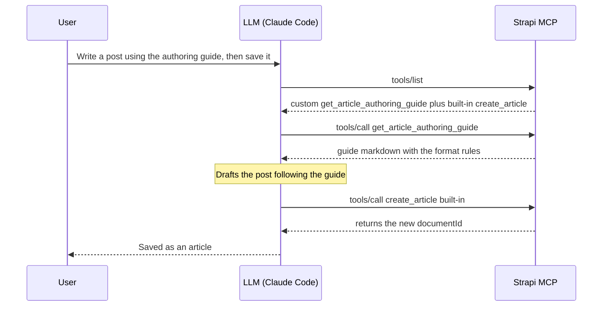

# Extending Strapi 5.47's MCP Server With a Custom Plugin

**TL;DR**

- Strapi 5.47+ ships an MCP server **built in**. You enable it with one line in `config/server.ts`, point an MCP client (Claude Code, Cursor, Windsurf) at `/mcp`, and you immediately get CRUD tools for every content type, gated by the admin token's permissions.
- The out-of-the-box CRUD tools cover content types. **They do not cover custom controllers, custom workflows, or anything that isn't a plain entity.** That's where custom tools come in.
- You can call `strapi.ai.mcp.registerTool(...)` from anywhere in the `register()` phase, but wrapping that in a **plugin** makes the work shareable, versionable, and gives a clean folder structure once you have more than one tool.
- For a multi-step workflow, add a custom `get_*_guide` tool for your format rules and let the model save with the **built-in** content-type tools.
- The reference implementation lives in [this example project](https://github.com/PaulBratslavsky/strapi-mcp-demo-and-tool-extension): the plugin, the full folder layout, and a long-term proposal for upstream Strapi.

## What is MCP, and why does it matter?

The [Model Context Protocol](https://modelcontextprotocol.io/) is an open standard for letting LLMs talk to external systems. Think of it as USB-C for AI: any MCP-compatible client (Claude Code, Claude Desktop, Cursor, Windsurf, Gemini CLI, …) can connect to any MCP-compatible server (Strapi, GitHub, Linear, Sentry, …) without bespoke glue code.

A server can expose three kinds of capability: **tools**, **resources**, and **prompts**. It can also send a block of **instructions** when a client connects. That last one is a field on the connection response, not a separate capability, but it acts like a fourth option.

The difference that matters: some of these the model picks up and uses on its own, and some only run when the human clicks them. That difference decides which one to use for a custom workflow.

| Primitive | Discovery | Auto-loaded by the LLM? |
|---|---|---|
| **Tools** | `tools/list` — model-controlled | ✅ Yes — the LLM decides when to call |
| **Prompts** | `prompts/list` — user-triggered slash commands | ❌ Only when the user explicitly invokes them |
| **Resources** | `resources/list` — application-controlled | ⚠️ Client-dependent (Claude Code does **not** auto-fetch) |
| **Server Instructions** | `initialize` response | ✅ Yes — injected into the system prompt at connection |

The "auto-loaded" column is the one to watch. It decides whether the model uses a capability on its own or waits for the user to trigger it.

Out of the box, Strapi fills only one of those rows: it auto-derives **tools** from your content types. It registers no prompts or resources by default, and it sends no server instructions. So on a fresh Strapi, tools are the whole surface.

## Before you begin

You need a Strapi v5 project on 5.47.0 or later. That is when the built-in MCP server [shipped, as a Beta feature](https://docs.strapi.io/cms/features/strapi-mcp-server). The examples here count `article`, `author`, and `category` entries, so the project needs those content types with some data in them.

The `--example` flag on `create-strapi-app` gives you exactly that: a fresh project preloaded with Strapi's example blog (articles, authors, and categories).

```bash
npx create-strapi-app@latest my-app --example
```

This is a clean project, so you add MCP and build the custom tools yourself by following along. The [finished version](https://github.com/PaulBratslavsky/strapi-mcp-demo-and-tool-extension) (this post's example repo, with MCP and the plugin already wired up) is there to compare against. Already have a Strapi 5.47+ project? Use it, and put your own content types in place of `article`/`author`/`category`.

## Step 1: Turn on the built-in MCP server

The server is off by default. Open `config/server.ts` and add `mcp.enabled: true`:

```ts
// config/server.ts
import type { Core } from '@strapi/strapi';

export default ({ env }: Core.Config.Shared.ConfigParams): Core.Config.Server => ({
  host: env('HOST', '0.0.0.0'),
  port: env.int('PORT', 1337),
  app: { keys: env.array('APP_KEYS') },
  mcp: { enabled: true },          // ← that's the whole thing
});
```

Restart Strapi. The MCP endpoint is now live at `http://localhost:1337/mcp`.

> To tune the transport timeouts (`connectTimeoutMs`, `requestTimeoutMs`), see [Advanced options](https://docs.strapi.io/cms/features/strapi-mcp-server#advanced-options).

### Heads-up #1: the right token

The MCP server uses **Admin API Tokens**, not Content API Tokens. These are two different permission systems, not the same screen in two places. A Content API token grants per-controller-action access (check `find`, `create`, and so on for each content type). An Admin token uses Strapi's role-based access control (RBAC): it inherits what its owner's admin roles allow. They live under different menus:

- ❌ **Settings → API Tokens**: these are for the Content API (`/api/...`). MCP rejects them with a 401.
- ✅ **Settings → Admin Tokens**: this is the one MCP accepts.

Give the Admin token the **least** access it needs, and add permissions as you go. This is the opposite of the usual "Full Access for local dev" habit, and the reason is specific to MCP: every content-type permission you enable turns into a set of MCP tools (up to about six per content type: `list`, `get`, `create`, `update`, `delete`, `publish`). Enable everything across, say, ten content types and the client sees roughly sixty tools, each with a full schema. All of that lands in the model's context before it does any work. A narrow token keeps the tool list short and the context focused on what the workflow actually touches. ("Full Access" in one click is really a Content API token idea; for Admin tokens, scope deliberately.) The token value is shown only once, so copy it as soon as it appears.

### Heads-up #2: the token decides which tools appear

The built-in tools you can use depend on the token's permissions (custom tools come later). A read-only token shows only the `list_*` and `get_*` tools. 

A token with write access also shows create, update, delete, and publish. You can't see more tools than the token allows; the docs cover this under [Permission boundaries](https://docs.strapi.io/cms/features/strapi-mcp-server#permission-boundaries).

### Connect from Claude Code

Any MCP client needs the same three settings, whatever its config format:

- **URL**: `http://localhost:1337/mcp`
- **Transport**: `streamable-http`
- **Auth**: an `Authorization: Bearer <admin token>` header

The rest is client-specific. For Claude Code, following the [Connecting Claude Code](https://docs.strapi.io/cms/features/strapi-mcp-server#connecting-claude-code) doc:

```bash
claude mcp add strapi-mcp --transport http http://localhost:1337/mcp \
  -H "Authorization: Bearer YOUR_ADMIN_TOKEN"
```

Start a new Claude Code session and run `/mcp`. It should show `strapi-mcp ✓ Connected`. Now you can ask things like *"list the 3 most recent articles"* and the built-in tools answer.

**Claude Desktop** doesn't speak `streamable-http` directly, so it connects through the `mcp-remote` bridge. Add this to `claude_desktop_config.json` (macOS: `~/Library/Application Support/Claude/`, Windows: `%APPDATA%\Claude\`) and restart Desktop:

```json
{
  "mcpServers": {
    "strapi-mcp": {
      "command": "npx",
      "args": [
        "-y", "mcp-remote", "http://localhost:1337/mcp",
        "--header", "Authorization: Bearer YOUR_ADMIN_TOKEN"
      ]
    }
  }
}
```

Cursor and Windsurf have their own config formats; the [AI client configuration](https://docs.strapi.io/cms/features/strapi-mcp-server#ai-client-configuration) docs cover all four.

## Step 2: When the built-in tools aren't enough

For every content type, the built-in MCP server creates a set of tools automatically: `list`, `get`, `create`, `update`, `delete`, plus `publish`, `unpublish`, and `discard_draft` when Draft & Publish is on. The full list is in the [Content-type tools](https://docs.strapi.io/cms/features/strapi-mcp-server#content-type-tools) docs. This covers reading and writing entries.

It does not cover anything you wrote by hand: a custom controller, an aggregation, a computed view, a multi-step flow. If you have a `src/api/<thing>/controllers/<thing>.ts` with your own logic in it, the MCP server has no tool for it.

Say you've written a `stats` service that aggregates a few counts:

```ts
// src/api/stats/services/stats.ts
export default {
  async overview() {
    const [articles, authors, categories] = await Promise.all([
      strapi.documents('api::article.article').count({ status: 'published' }),
      strapi.documents('api::author.author').count({}),
      strapi.documents('api::category.category').count({}),
    ]);
    return { articles, authors, categories };
  },
};
```

None of the built-in tools know it exists. To expose it to the model, you register a custom tool.

## Step 3: Register a custom tool

The function to call is `strapi.ai.mcp.registerTool({...})`; the [Plugin API](https://docs.strapi.io/cms/features/strapi-mcp-server#plugin-api) section is the entry point. Two rules matter before you start:

- **Register before the MCP server starts.** Strapi locks the tool list at startup, and the start happens at a specific point in the boot order: plugin `register()` → plugin `bootstrap()` → MCP server starts → app `bootstrap()` (your `src/index.ts`). So from inside a plugin you can register in either `register()` or `bootstrap()`. From the app's own `src/index.ts`, only `register()` is early enough; registering in `src/index.ts` `bootstrap()` runs after the server has started and throws. `register()` is the cleanest place. `bootstrap()` runs later, after Strapi's services (the document service, the database) are fully ready, so register there if your tool's setup needs them at registration time. (The tool's `createHandler` always runs at request time, so handlers have full service access either way.) Strapi clarified this registration lifecycle in [PR #26517](https://github.com/strapi/strapi/pull/26517).
- **Required fields are `name`, `title`, `description`, `resolveOutputSchema`, and either `auth` or `devModeOnly`.** `resolveInputSchema` is optional; leave it out for a tool that takes no arguments. The schema fields are functions, not plain objects. Strapi calls them on each request and passes the caller's permissions (`context.userAbility`), so a tool can return a narrower schema for a less-privileged token. The `z` you build the schema with (Strapi's bundled copy of [Zod](https://github.com/colinhacks/zod)) has to come from `@strapi/utils`, not the `zod` package directly.

Here is the smallest working tool, registered straight in `src/index.ts`:

```ts
// src/index.ts — works, but doesn't scale
import { z } from '@strapi/utils';

export default {
  register({ strapi }) {
    strapi.ai.mcp.registerTool({
      name: 'get_stats_overview',
      title: 'Get content stats overview',
      description: 'Return aggregate counts of published articles, authors, and categories.',
      resolveOutputSchema: () => z.object({
        articles: z.number().int().nonnegative(),
        authors:  z.number().int().nonnegative(),
        categories: z.number().int().nonnegative(),
      }),
      auth: {
        policies: [
          { action: 'plugin::content-manager.explorer.read', subject: 'api::article.article' },
        ],
      },
      createHandler: (strapi) => async () => {
        const overview = await strapi.service('api::stats.stats').overview();
        return {
          content: [{ type: 'text', text: JSON.stringify(overview) }],
          structuredContent: overview,
        };
      },
    });
  },
  bootstrap() {},
};
```

Restart Strapi. The model now sees a `get_stats_overview` tool, calls it when it needs those counts, and gets back the typed object your schema describes.

That is a custom tool, start to finish. The rest of this post builds on the same `registerTool` call: giving a tool its own permission, packaging tools in a plugin, and chaining a tool into a multi-step workflow. The [example repo](https://github.com/PaulBratslavsky/strapi-mcp-demo-and-tool-extension) has more tools to read through, including `list_recent_articles` and `get_content_api_docs`.

### A note on that `auth` block

The example above gates `get_stats_overview` on a content-manager permission, `plugin::content-manager.explorer.read`. That works as a first pass, but it ties the tool to content-manager access: the tool appears only for a token that can read those types in the Content Manager, and it shares the permission the built-in content-type tools already use. You can't turn the tool on or off on its own.

For tools that are their own thing, register your own admin permissions and gate on those. Give each tool its own permission so an admin can switch tools on one at a time. The API is the one core plugins use, `actionProvider.registerMany`, called during `register()`:

```ts
// server/src/mcp/permissions.ts
const PLUGIN_NAME = 'strapi-extended-mcp';

// One action per tool. UIDs come out as plugin::strapi-extended-mcp.<uid>.
const ACTION_DEFS = [
  { uid: 'stats.read',    displayName: 'Read content stats overview' },
  { uid: 'articles.read', displayName: 'List recent articles' },
  { uid: 'api-docs.read', displayName: 'Read Content API documentation' },
  { uid: 'guide.read',    displayName: 'Read the article authoring guide' },
  { uid: 'info.read',     displayName: 'Read extended MCP plugin info' },
];

export const MCP_ACTIONS = {
  STATS_READ:    `plugin::${PLUGIN_NAME}.stats.read`,
  ARTICLES_READ: `plugin::${PLUGIN_NAME}.articles.read`,
  API_DOCS_READ: `plugin::${PLUGIN_NAME}.api-docs.read`,
  GUIDE_READ:    `plugin::${PLUGIN_NAME}.guide.read`,
  INFO_READ:     `plugin::${PLUGIN_NAME}.info.read`,
};

export const registerMcpPermissions = async (strapi) => {
  await strapi.service('admin::permission').actionProvider.registerMany(
    ACTION_DEFS.map((a) => ({ section: 'plugins', pluginName: PLUGIN_NAME, ...a }))
  );
};
```

Each tool then gates on its own action:

```ts
// get-stats-overview.ts
auth: { policies: [{ action: MCP_ACTIONS.STATS_READ }] },  // plugin::strapi-extended-mcp.stats.read
```

This is not an MCP API. It is Strapi's normal role-based access control. The MCP gate just runs `ability.can(action)` against the token's permissions for whatever action you named.

**Granting the permissions (this happens in the admin, not in code).** Registering an action does not grant it. Each registered action shows up as a checkbox in the admin: open **Settings → Admin Tokens**, edit (or create) a token, go to the **Plugins** tab, and under **Strapi extended mcp** you'll see one checkbox per tool:

```
Plugins ▸ Strapi extended mcp
  [✓] Read content stats overview      → get_stats_overview
  [✓] List recent articles             → list_recent_articles
  [✓] Read Content API documentation   → get_content_api_docs
  [ ] Read the article authoring guide → get_article_authoring_guide
  [ ] Read extended MCP plugin info    → get_extended_mcp_info
```

Check the tools you want this token to expose and **Save**. The same checkboxes appear on a **role** (Settings → Roles), if you'd rather grant by role than per token.

The gating works both ways. A tool you granted is visible in `tools/list`, and you can call it. A tool you did not grant is not in the list, and calling it by name is rejected with `Tool <name> disabled` rather than silently ignored. So with the three boxes above checked, `get_stats_overview`, `list_recent_articles`, and `get_content_api_docs` work. The other two stay gated until you check them too. The example repo's `npm run test:mcp` checks exactly this for whatever you've granted: granted tools are callable, gated tools reject the call.

`auth.policies` is the first gate: it decides whether the token sees the tool at all. You can add a second, finer check inside the handler. The handler gets `(strapi, context)`: `context.userAbility` is the caller's permission set, and `context.user` is the token owner. With those you can check a single document or field, which the policy gate can't. For example, refuse one document the token may list but not read:

```ts
createHandler: (strapi, context) => async ({ args }) => {
  if (!context.userAbility.can('plugin::content-manager.explorer.read', 'api::article.article')) {
    return { content: [{ type: 'text', text: 'Not allowed.' }], isError: true };
  }
  // …safe to proceed
},
```

This is the same engine Strapi's own content-type tools use to narrow fields and locales per request.

So why bother with a plugin?

## Step 4: Why we wrapped this in a plugin

Registering tools directly in `src/index.ts` works. Plenty of small projects do exactly that. We chose a plugin instead, and the reasons add up once you have more than one or two tools:

- **It keeps the code in one place.** Everything MCP-related sits under `src/plugins/strapi-extended-mcp/`. None of it mixes into the app's own `src/index.ts` or `src/lib/`. Someone opening the project later sees the folder name and knows what is inside.
- **It is portable.** A Strapi plugin is a folder with a `package.json`. You can `npm publish` it, or copy it into another Strapi project, and every tool comes with it, already wired up. The other project does not have to touch its own `src/index.ts`.
- **It has room to grow.** Five tools, a couple of guide files, some shared helpers: the plugin's `server/src/` folder holds all of it, and the app root stays clean.
- **It has the right lifecycle hooks.** A plugin gets its own `register`, `bootstrap`, and `destroy` functions. Tool registration belongs in `register()`, and the plugin gives you that function directly.

The cost: after every source change you run `npm run build` inside the plugin folder, then restart Strapi. The plugin loads from its `dist/` folder (the `exports` field in its `package.json` points there), so an un-built change has no effect. To avoid the manual rebuild during development, run `strapi-plugin watch:link`.

## Step 5: Scaffold the plugin

```bash
mkdir -p src/plugins/strapi-extended-mcp
cd src/plugins/strapi-extended-mcp
npx @strapi/sdk-plugin@latest init .
```

Answer the prompts (plugin name `strapi-extended-mcp`, no admin panel UI needed for this case). Then wire it up in your main Strapi `config/plugins.ts`:

```ts
// config/plugins.ts
export default () => ({
  'strapi-extended-mcp': {
    enabled: true,
    resolve: './src/plugins/strapi-extended-mcp',
  },
});
```

(`config/plugins.ts` may not exist in a fresh project; create it with the export above.)

## Step 6: The modular folder pattern

The default scaffold gives you `server/src/{register,bootstrap,destroy}.ts` and a `controllers/services/routes` tree we don't need. We added a small tree under `server/src/mcp/` with only what the plugin uses:

```
server/src/
├── register.ts                ← 1-liner: calls registerMcpTools(strapi)
└── mcp/
    ├── index.ts               ← loads every tool and registers it with strapi.ai.mcp
    ├── types.ts               ← the shared StrapiMcpToolModule type
    ├── permissions.ts         ← registers the plugin's own admin permission
    ├── guides/                ← long-form instruction content
    │   ├── article-authoring-guide.md   ← human-readable source of truth
    │   └── article-authoring-guide.ts   ← TS mirror exporting the markdown as a string
    └── tools/
        ├── index.ts                       ← export const tools = [...]
        ├── get-stats-overview.ts          ← simple read tool
        ├── list-recent-articles.ts        ← read tool with input args
        ├── get-content-api-docs.ts        ← lists api:: types, endpoints, fields
        ├── get-article-authoring-guide.ts ← returns guide markdown on demand
        └── get-extended-mcp-info.ts       ← gated on the plugin's own permission
```

**To add a tool: drop a file in `tools/`, add one line to `tools/index.ts`, run `npm run build`, restart.** That is all it takes.

Two choices in this layout are worth explaining.

### Why the `.ts` mirror of the `.md`?

`@strapi/sdk-plugin` uses vite to bundle the plugin into a single `dist/server/index.js`. Vite does not copy `.md` files into that bundle, so a `.md` file the runtime tries to read at startup would not be there. Two ways around it:

1. Configure vite to copy the `.md` files in.
2. Put the markdown in a `.ts` file as a `String.raw` template literal.

We went with option 2. It works in both dev and production builds with no extra config. The `.md` file stays next to the `.ts` as the version a human edits, and the `.ts` is what the running plugin imports. The downside: edit the `.md` and you have to copy the change into the `.ts` by hand. A vite plugin that copies it automatically would remove that step.

### Why a `types.ts`?

Every tool file declares the same shape, so the file that loads them can loop over them without resorting to `any`:

```ts
// server/src/mcp/types.ts
import type { Core } from '@strapi/strapi';

export type RegisterTool = Core.Strapi['ai']['mcp']['registerTool'];

export type StrapiMcpToolModule = {
  register: (registerTool: RegisterTool, strapi: Core.Strapi) => void;
};
```

You can also reach the same type through `Modules.MCP.McpService['registerTool']`. And Strapi core has an identity helper, [`makeMcpToolDefinition`](https://github.com/strapi/strapi/blob/develop/packages/core/core/src/services/mcp/tool-registry.ts) (used internally by the built-in `log` tool), that may be exported for plugin authors later. Until it is, the local type above does the job.

Each tool file then looks like:

```ts
// server/src/mcp/tools/get-stats-overview.ts
import { z } from '@strapi/utils';
import type { StrapiMcpToolModule } from '../types';

const tool: StrapiMcpToolModule = {
  register(registerTool) {
    registerTool({ /* …name, schemas, auth, createHandler… */ });
  },
};

export default tool;
```

The file that loads them imports the list (`./tools` resolves to the `tools/index.ts` barrel above) and calls each one's `register`:

```ts
// server/src/mcp/index.ts
import type { Core } from '@strapi/strapi';
import { tools } from './tools';

export const registerMcpTools = (strapi: Core.Strapi) => {
  if (!strapi.ai.mcp.isEnabled()) {
    strapi.log.warn('[strapi-extended-mcp plugin] MCP not enabled — skipping.');
    return;
  }
  // registerTool is a closure on the service, not a this-method,
  // so it can be passed around directly — no bind needed.
  const { registerTool } = strapi.ai.mcp;
  for (const tool of tools) tool.register(registerTool, strapi);
  strapi.log.info(`[strapi-extended-mcp plugin] Registered ${tools.length} custom MCP tool(s).`);
};
```

And the plugin's `register.ts` wires both halves together: it registers the
admin permissions, then the tools. (Register the permissions first so the actions
exist before a tool's `auth.policies` references them.)

```ts
// server/src/register.ts
import { registerMcpPermissions } from './mcp/permissions';
import { registerMcpTools } from './mcp';

export default async ({ strapi }) => {
  await registerMcpPermissions(strapi);
  registerMcpTools(strapi);
};
```

That is the whole wiring. After this, every new tool is one new file plus one
line in the list (and, if it needs its own permission, one entry in
`permissions.ts`).

## Step 7: Chained tools for LLM workflows

`get_stats_overview` is a single call: the model asks for it, gets the data, and is done. Read tools work that way. A workflow is harder, because it is more than one step.

The goal: the user says *"write a blog post about Next.js server actions and save it as a draft,"* and the model writes it in our format (a TL;DR section, a citations block, and so on) without us repeating those rules every time.

The first attempt was an MCP **prompt** called `write_technical_blog_post` that returned the format rules. It did not work, and the reason is the "auto-loaded" column from the table at the top. A prompt only runs when the user picks it. In Claude Code and other clients, prompts show up as slash commands the user clicks. The model will not fetch a prompt on its own just because the task seems to call for it. So the format rules sat in a prompt the model never opened.

The custom part is just the guide. Saving uses the built-in `create_article` tool, the one Strapi already generates from the Article content type:

```ts
// server/src/mcp/tools/get-article-authoring-guide.ts
const tool: StrapiMcpToolModule = {
  register(registerTool) {
    registerTool({
      name: 'get_article_authoring_guide',
      title: 'Get the article authoring guide',
      description:
        "Return the required output format and section rules for writing articles in this Strapi instance. " +
        "Call this BEFORE drafting article content, then follow the returned format when saving the article " +
        "with the built-in `create_article` tool (put the formatted markdown in a shared.rich-text block under `blocks`).",
      resolveOutputSchema: () => z.object({ guide_markdown: z.string() }),
      auth: { policies: [{ action: MCP_ACTIONS.GUIDE_READ }] },  // plugin::strapi-extended-mcp.guide.read
      createHandler: () => async () => ({
        content: [{ type: 'text', text: ARTICLE_AUTHORING_GUIDE_MD }],
        structuredContent: { guide_markdown: ARTICLE_AUTHORING_GUIDE_MD },
      }),
    });
  },
};
```

An earlier draft of this plugin shipped a custom `create_article_draft` tool that created the article itself and carried the "call the guide first" instruction in its description. We dropped it, for two reasons. It overlapped with the built-in `create_article` and `update_article` tools, so a model facing both has to guess which one to use. And to write articles it had to borrow the same `plugin::content-manager.explorer.create` permission the built-in tool already uses, so the two were doing the same job through the same permission. The built-in tool already writes articles with the right permissions. The only piece worth adding is the format guide.

This choice costs us something. With a custom save tool, we owned its description, so we could put `REQUIRED: call get_article_authoring_guide first` right where the model would read it. The model would then chain the two on its own. The built-in `create_article` tool's description is not ours to edit, so that automatic trigger is gone. The guide tool still exists, but the model only reads it if something tells it to: the user asking for it, or (once Strapi supports it) server instructions. That gap is what the next section is about.



### Why not MCP server instructions?

There is a better fit for this in the protocol: [MCP server instructions](https://blog.modelcontextprotocol.io/posts/2025-11-03-using-server-instructions/). The server sends a block of text when a client connects, and the client is meant to add it to the model's system prompt (exactly how a client uses it is up to that client). This is the part built for "the model should always read X before using this server," and it loads on connect without the user doing anything.

Strapi 5.47 does not let a plugin set it. The MCP SDK underneath supports an `instructions` field, but Strapi builds the server (in `McpServerFactory.ts`, with `new McpServer(...)`) without passing one, and there is no plugin method to supply it. We wrote [a draft proposal in the repo](https://github.com/PaulBratslavsky/strapi-mcp-demo-and-tool-extension/blob/main/PR-DRAFT-mcp-server-instructions.md) (`PR-DRAFT-mcp-server-instructions.md`) to add a `setInstructions()` method to `strapi.ai.mcp`.

Until that exists, the two-tool approach (a guide tool plus a save tool whose description points at it) is the way to make a model follow a multi-step workflow. It is also what larger MCP servers such as Linear, Sentry, and GitHub do today.

One more reason to stay with tools here: a tool is the only capability the model calls on its own. Prompts and resources are registerable too (the next section shows how), but a prompt only runs when the user picks it, and many clients never auto-fetch resources, so neither one drives an autonomous workflow.

## Beyond tools: prompts and resources

Tools are not the only thing a plugin can register. `strapi.ai.mcp` also takes **prompts** and **resources**, and the same rules apply to all three: register them before the server starts (in `register()` or the plugin's `bootstrap()`), and gate each one with `auth.policies` or mark it `devModeOnly`.

They cover different needs:

- A **tool** is something the model decides to call. That is why the workflow above is built from tools.
- A **prompt** is a message template the user picks; it shows up as a slash command in the client. The model does not fetch it on its own.
- A **resource** is read-only content behind a fixed URI that a client can read. Not every client fetches resources automatically.

A prompt registration:

```ts
strapi.ai.mcp.registerPrompt({
  name: 'strapi-extended-mcp_write-release-note',
  title: 'Write release note',
  description: 'Draft a release note for a plugin change.',
  auth: { policies: [{ action: 'admin::webhooks.read' }] },
  argsSchema: z.object({ change: z.string().min(1) }),
  createHandler: () => async (args) => ({
    messages: [
      {
        role: 'user',
        content: { type: 'text', text: `Write a concise release note for: ${args.change}` },
      },
    ],
  }),
});
```

A resource registration:

```ts
strapi.ai.mcp.registerResource({
  name: 'strapi-extended-mcp_config',
  uri: 'strapi://strapi-extended-mcp/config',
  metadata: {
    title: 'Plugin config',
    description: 'Public configuration for the plugin.',
    mimeType: 'application/json',
  },
  auth: { policies: [{ action: 'admin::webhooks.read' }] },
  createHandler: (strapi) => async (uri) => ({
    contents: [
      {
        uri: uri.href,
        mimeType: 'application/json',
        text: JSON.stringify(strapi.config.get('plugin::strapi-extended-mcp.public', {}), null, 2),
      },
    ],
  }),
});
```

One naming rule applies to all three: capability names are **global across every plugin** on the server. Prefix yours with the plugin name (`strapi-extended-mcp_…`) so it can't collide with a tool from another plugin. (The example tools in this post use short names like `get_stats_overview` for readability; in a plugin you'd publish, namespace them.)

## Gotchas

These cost us time and are not in the docs:

- **The plugin loads from `dist/`, not `server/src/`.** After every source change, run `npm run build` in the plugin folder and restart Strapi. If you edit the source and skip the build, nothing changes and it looks like your edit did nothing.
- **MCP needs an Admin Token, not a Content API Token.** They are created on different settings pages and look the same. Only the Admin Token works.
- **Build schemas with `z` from `@strapi/utils`, not from the `zod` package.** Strapi pulls in zod 3 as a dependency. If your project also has zod 4, importing `zod` directly can load the wrong version and crash. The `z` from `@strapi/utils` is the one Strapi is using, so use that.
- **Multiple policies are OR, not AND.** When `auth.policies` has more than one entry, the token passes if it satisfies any one of them. So if you list a content-manager read policy and a plugin policy on the same tool, a token with either one can call it.
- **Permission action strings must be exact.** When you gate on a content-manager permission, use the exact action strings Strapi's content-manager uses:
  - `plugin::content-manager.explorer.read`
  - `plugin::content-manager.explorer.create`
  - `plugin::content-manager.explorer.update`
  - `plugin::content-manager.explorer.delete`
  - `plugin::content-manager.explorer.publish`
- **Dynamic zones are awkward.** Strapi's MCP server documents this under [Known limitations](https://docs.strapi.io/cms/features/strapi-mcp-server#known-limitations) (dynamic zones are passed as untyped arrays; you also can't upload new media via MCP). For the article-writing flow, the guide tells the model to put all the prose in a single `shared.rich-text` block, which avoids the dynamic-zone sharp edges. A human editor can split it into other blocks in the admin afterward.
- **Strapi does not fill in `uid` fields automatically when a tool creates an entry.** A `slug` field stays empty unless the caller sends one. If you want a slug, have the model pass it, or set a default in a content-type lifecycle hook.

## When to skip the plugin

A plugin is not always the right call. If you have **one or two tools**, no plans to share them, and you do not mind a few extra lines in `src/index.ts`, call `strapi.ai.mcp.registerTool` directly in your app's `register()` hook. The plugin is worth it when:

- You have three or more tools, or expect to.
- You want to publish the integration or reuse it in another project.
- The tools belong together as one feature.

Pulling a plugin out before you need it costs the same as any other early abstraction: more structure to maintain than the problem currently calls for.

## About the example project

Every line of code in this post comes from a working example you can clone and run: [`PaulBratslavsky/strapi-mcp-demo-and-tool-extension`](https://github.com/PaulBratslavsky/strapi-mcp-demo-and-tool-extension).

```bash
git clone https://github.com/PaulBratslavsky/strapi-mcp-demo-and-tool-extension.git
```

The repo includes:

- The full plugin scaffold at `src/plugins/strapi-extended-mcp/`
- Working tools: `get_stats_overview`, `list_recent_articles`, `get_content_api_docs`, `get_article_authoring_guide`, and `get_extended_mcp_info` (the dedicated-permission demo)
- Five per-tool admin permissions (`plugin::strapi-extended-mcp.*`) registered via `actionProvider.registerMany`, each gating one tool, grantable per-tool from the Admin Tokens UI
- A small end-to-end test script (`scripts/test-mcp.mjs`, runnable with `npm run test:mcp`)
- Better Auth replacing `users-permissions` (separate write-up)
- `PR-DRAFT-mcp-server-instructions.md`, the proposal for adding server-instructions support to Strapi's MCP

Start it up, create an admin token, and point Claude Code, Cursor, or Windsurf at `http://localhost:1337/mcp`. From there you can reproduce everything in this post.

## Further reading in the Strapi docs

The official [Strapi MCP server documentation](https://docs.strapi.io/cms/features/strapi-mcp-server) is the canonical reference. The sections most relevant to this post:

- [Configuration → Strapi code-based configuration](https://docs.strapi.io/cms/features/strapi-mcp-server#strapi-code-based-configuration) — the `config/server.ts` toggle
- [Advanced options](https://docs.strapi.io/cms/features/strapi-mcp-server#advanced-options) — transport timeouts
- [AI client configuration](https://docs.strapi.io/cms/features/strapi-mcp-server#ai-client-configuration) — connecting Claude Code, Cursor, Windsurf, Claude Desktop
- [Available tools](https://docs.strapi.io/cms/features/strapi-mcp-server#available-tools) / [Content-type tools](https://docs.strapi.io/cms/features/strapi-mcp-server#content-type-tools) — the auto-derived CRUD surface
- [Permission boundaries](https://docs.strapi.io/cms/features/strapi-mcp-server#permission-boundaries) — how the admin token caps tool exposure
- [Stateless architecture](https://docs.strapi.io/cms/features/strapi-mcp-server#stateless-architecture) — why every request is independently authenticated
- [Known limitations](https://docs.strapi.io/cms/features/strapi-mcp-server#known-limitations) — dynamic zones, media uploads, etc.
- [Plugin API](https://docs.strapi.io/cms/features/strapi-mcp-server#plugin-api) — `strapi.ai.mcp.registerTool`, the basis for everything custom in this post

**Citations**

- Strapi MCP server documentation: https://docs.strapi.io/cms/features/strapi-mcp-server
- Model Context Protocol homepage: https://modelcontextprotocol.io
- MCP Tools specification: https://modelcontextprotocol.io/specification/2025-11-25/server/tools
- MCP Resources concept: https://modelcontextprotocol.io/legacy/concepts/resources
- MCP Server Instructions (blog post): https://blog.modelcontextprotocol.io/posts/2025-11-03-using-server-instructions/
- MCP Prompts and Resources — DEV community: https://dev.to/aws-heroes/mcp-prompts-and-resources-the-primitives-youre-not-using-3oo1
- Best Practices for Building MCP Servers — Phil Schmid: https://www.philschmid.de/mcp-best-practices
- MCP Cheat Sheet 2026: https://www.webfuse.com/mcp-cheat-sheet
- Strapi SDK Plugin: https://github.com/strapi/sdk-plugin
