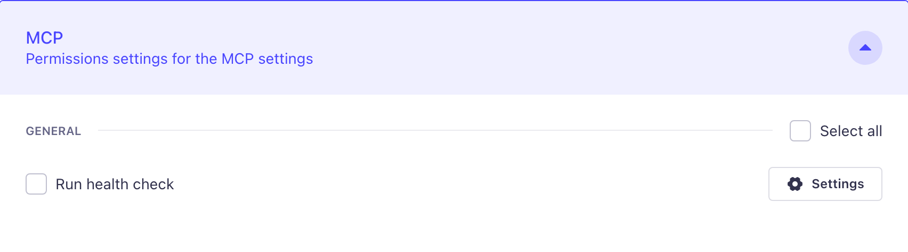

# Reference: a health-check MCP tool (inline, with its own permission)

A minimal, content-agnostic custom MCP tool for Strapi v5.47+. It returns the
server's status, uptime, and version. It is registered directly in the app
(`src/index.ts`), and it registers its **own** admin permission so it can be
granted per token (fine-grained control you don't get by reusing an existing
permission).

This is a standalone reference. The main walkthrough
(`BLOG-strapi-mcp-custom-tools.md`) uses a stats tool for the inline example;
this shows the same inline pattern with a simpler, dependency-free tool (no
content types or seed data needed).

The inline registration and the app-level permission were verified on Strapi
5.48.0 (the permission shows up under the Admin Token's Settings tab, below).

## 1. Enable the MCP server

```ts
// config/server.ts — add the mcp key to the generated config
mcp: { enabled: true },
```

## 2. The health API (service + controller + route)

The logic lives in a **service**. A **controller** and **route** also expose it
at `GET /api/health` (optional — the MCP tool calls the service directly, so it
does not need the controller or route).

```ts
// src/api/health/services/health.ts
export default {
  check() {
    return {
      status: 'ok',
      uptimeSeconds: Math.round(process.uptime()),
      strapiVersion: strapi.config.get('info.strapi', 'unknown'),
    };
  },
};
```

```ts
// src/api/health/controllers/health.ts
export default {
  async index(ctx) {
    ctx.body = await strapi.service('api::health.health').check();
  },
};
```

```ts
// src/api/health/routes/health.ts
export default {
  routes: [
    {
      method: 'GET',
      path: '/health',
      handler: 'health.index',
      config: { policies: [], middlewares: [] },
    },
  ],
};
```

## 3. Register the tool inline, with its own permission

```ts
// src/index.ts
import type { Core } from '@strapi/strapi';
import { z } from '@strapi/utils';

export default {
  async register({ strapi }: { strapi: Core.Strapi }) {
    if (!strapi.ai.mcp.isEnabled()) return;

    // An app is not a plugin, so its admin permission goes under
    // `section: 'settings'`. The action id comes out as `api::health.read`,
    // and it becomes a grantable checkbox on the admin token.
    await strapi.service('admin::permission').actionProvider.registerMany([
      { section: 'settings', category: 'MCP', displayName: 'Run health check', uid: 'health.read' },
    ]);

    strapi.ai.mcp.registerTool({
      name: 'get_health',
      title: 'Health check',
      description: 'Return basic Strapi health info: status, uptime, and version.',
      resolveOutputSchema: () =>
        z.object({
          status: z.string(),
          uptimeSeconds: z.number(),
          strapiVersion: z.string(),
        }),
      auth: { policies: [{ action: 'api::health.read' }] },
      createHandler: (strapi) => async () => {
        const payload = await strapi.service('api::health.health').check();
        return {
          content: [{ type: 'text', text: JSON.stringify(payload) }],
          structuredContent: payload,
        };
      },
    });
  },
  bootstrap() {},
};
```

## 4. Grant it on the admin token

Restart Strapi. The permission shows up under **Settings → Admin Tokens**, on a
token's **Settings** tab, in an **MCP** group:



Check **Run health check** and save; that token can now call the tool. (App-level
permissions land under the **Settings** tab; a plugin's per-tool permissions land
under the **Plugins** tab instead.)

## Notes

- Register inline in `register()`, not `bootstrap()`. The app's `bootstrap()`
  runs after the MCP server has started, and registering a tool there throws.
- Import `z` from `@strapi/utils`, not the `zod` package (Strapi bundles its own
  copy; a second one loads the wrong version and crashes the schema).
- The tool reads `process.uptime()` and `strapi.config.get('info.strapi')`, so it
  needs no content types or seed data and works on any Strapi 5.47+ project.
