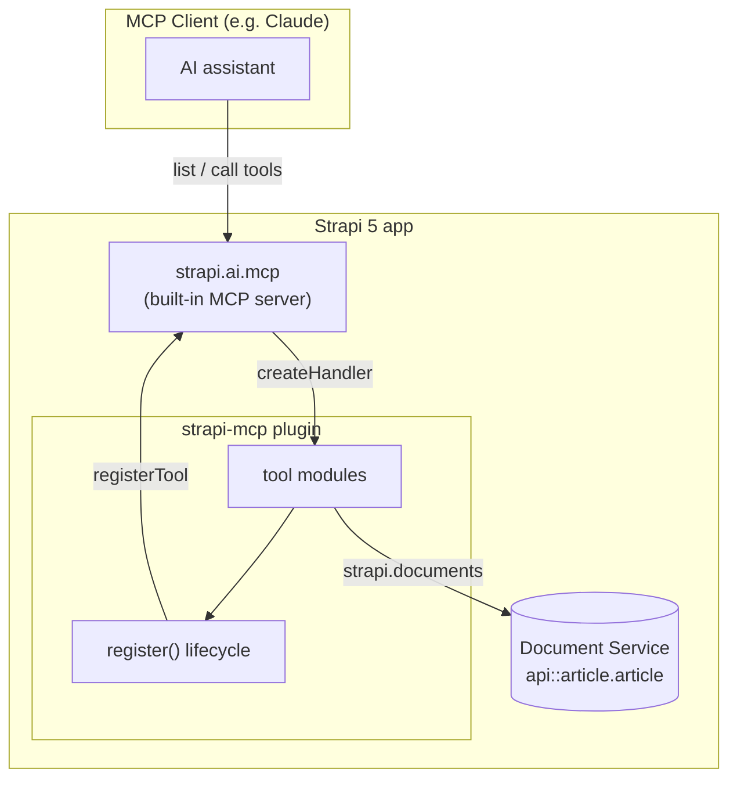

# How to Set Up an MCP Server, Create a Custom Plugin, and Register Custom Tools in Strapi 5

**TL;DR**

- Strapi 5.47+ ships a built-in MCP server. Turn it on with one flag (`mcp: { enabled: true }`) in `config/server.ts` — it exposes `strapi.ai.mcp` to your code.
- Custom tools live in a local plugin. Generate one with `@strapi/sdk-plugin`, then register it in `config/plugins.ts` with `enabled: true` and a `resolve` path.
- Register tools in the plugin's `register` lifecycle: guard on `strapi.ai.mcp.isEnabled()`, then call `strapi.ai.mcp.registerTool(...)` for each tool.
- A tool is just an object with `name`, `description`, Zod input/output schemas (`resolveInputSchema` / `resolveOutputSchema`), an `auth.policies` array, and a `createHandler` that returns both `content` (text) and `structuredContent`.
- Auth reuses Strapi's content-manager policies (e.g. `plugin::content-manager.explorer.create` on `api::article.article`), so tools run with the same permission model as the admin panel.

## What We're Building

The [Model Context Protocol](https://modelcontextprotocol.io) (MCP) is an open standard that lets AI clients — like Claude — discover and call tools on a server. Strapi 5 now speaks MCP natively, so you can hand an assistant a set of typed, permission-checked tools that operate directly on your content.

In this guide we'll wire up a plugin called `strapi-mcp` that registers four tools: list recent articles, fetch an authoring guide, create an article draft, and return a stats overview. Everything below mirrors a working plugin so you can copy the patterns directly.

## The Big Picture

There are three moving parts. Strapi's core hosts the MCP server; your plugin registers tools into it during boot; an MCP client connects and calls those tools, which run against your documents through the Document Service API.



## Step 1 — Turn On Strapi's MCP Server

The MCP server is off by default. Enable it in `config/server.ts`:

```typescript
// config/server.ts
import type { Core } from '@strapi/strapi';

const config = ({ env }: Core.Config.Shared.ConfigParams): Core.Config.Server => ({
  host: env('HOST', '0.0.0.0'),
  port: env.int('PORT', 1337),
  app: {
    keys: env.array('APP_KEYS'),
  },
  mcp: {
    enabled: true, // 👈 exposes strapi.ai.mcp to your plugins
  },
});

export default config;
```

That single flag is what makes `strapi.ai.mcp` available at runtime. If you skip it, tool registration is silently skipped (we guard for exactly that below).

## Step 2 — Generate a Local Plugin

Custom tools belong in a plugin so they have a clean `register` lifecycle hook. Scaffold one with the official SDK:

```bash
npx @strapi/sdk-plugin init src/plugins/strapi-mcp
```

This gives you the standard plugin layout. The server entry point at `server/src/index.ts` exports the lifecycle and resource methods:

```typescript
// src/plugins/strapi-mcp/server/src/index.ts
import bootstrap from "./bootstrap";
import destroy from "./destroy";
import register from "./register";

import config from "./config";
import contentTypes from "./content-types";
import controllers from "./controllers";
import middlewares from "./middlewares";
import policies from "./policies";
import routes from "./routes";
import services from "./services";

export default {
  register,   // 👈 where we'll register MCP tools
  bootstrap,
  destroy,
  config,
  controllers,
  routes,
  services,
  contentTypes,
  policies,
  middlewares,
};
```

## Step 3 — Register the Plugin

Tell Strapi to load the local plugin in `config/plugins.ts`:

```typescript
// config/plugins.ts
export default () => ({
  'strapi-mcp': {
    enabled: true,
    resolve: './src/plugins/strapi-mcp',
  },
});
```

`enabled` switches it on; `resolve` points at the folder, which is what marks it as a local (not npm-installed) plugin.

## Step 4 — Hook Into the `register` Lifecycle

The `register` method runs once, early in boot — the right time to add tools. Keep it thin and delegate to an MCP module:

```typescript
// src/plugins/strapi-mcp/server/src/register.ts
import type { Core } from "@strapi/strapi";
import { registerMcpTools } from "./mcp";

const register = ({ strapi }: { strapi: Core.Strapi }) => {
  registerMcpTools(strapi);
};

export default register;
```

The module itself does three things: check the MCP server is actually enabled, grab `registerTool`, and loop over every tool:

```typescript
// src/plugins/strapi-mcp/server/src/mcp/index.ts
import type { Core } from "@strapi/strapi";
import { tools } from "./tools";

export const registerMcpTools = (strapi: Core.Strapi) => {
  // Guard: if Step 1 was skipped, bail out gracefully instead of crashing.
  if (!strapi.ai?.mcp?.isEnabled()) {
    strapi.log.warn(
      "[strapi-mcp plugin] MCP server not enabled — skipping custom registration."
    );
    return;
  }

  const registerTool = strapi.ai.mcp.registerTool.bind(strapi.ai.mcp);
  for (const tool of tools) {
    tool.register(registerTool, strapi);
  }

  strapi.log.info(
    `[strapi-mcp plugin] Registered ${tools.length} custom MCP tool(s).`
  );
};
```

A shared type keeps every tool module consistent:

```typescript
// src/plugins/strapi-mcp/server/src/mcp/types.ts
import type { Core } from "@strapi/strapi";

export type RegisterTool = Core.Strapi["ai"]["mcp"]["registerTool"];

export type StrapiMcpToolModule = {
  register: (registerTool: RegisterTool, strapi: Core.Strapi) => void;
};
```

## Step 5 — Write Your First Tool (Read)

A tool is an object with a `register` method that calls `registerTool(...)`. Here's a read-only tool that lists recent articles. Note the Zod schemas (from `@strapi/utils`), the `auth.policies` block, and the handler returning **both** a text `content` array and `structuredContent`:

```typescript
// src/plugins/strapi-mcp/server/src/mcp/tools/list-recent-articles.ts
import { z } from "@strapi/utils";
import type { StrapiMcpToolModule } from "../types";

const tool: StrapiMcpToolModule = {
  register(registerTool) {
    registerTool({
      name: "list_recent_articles",
      title: "List recent articles",
      description:
        "Return the most recently published articles, newest first. Supports an optional limit (default 5, max 25).",
      resolveInputSchema: () =>
        z.object({
          limit: z.number().int().min(1).max(25).optional(),
        }),
      resolveOutputSchema: () =>
        z.object({
          count: z.number().int().nonnegative(),
          articles: z.array(
            z.object({
              documentId: z.string(),
              title: z.string(),
              slug: z.string().nullable(),
              publishedAt: z.string().nullable(),
            })
          ),
        }),
      // Reuse Strapi's content-manager permission model.
      auth: {
        policies: [
          {
            action: "plugin::content-manager.explorer.read",
            subject: "api::article.article",
          },
        ],
      },
      createHandler: (strapi) => async ({ args }) => {
        const limit = args?.limit ?? 5;
        const entries = await strapi
          .documents("api::article.article")
          .findMany({
            status: "published",
            sort: { publishedAt: "desc" },
            limit,
            fields: ["title", "slug", "publishedAt"],
          });

        const articles = entries.map((e: any) => ({
          documentId: e.documentId,
          title: e.title ?? "",
          slug: e.slug ?? null,
          publishedAt: e.publishedAt
            ? new Date(e.publishedAt).toISOString()
            : null,
        }));

        const payload = { count: articles.length, articles };
        return {
          content: [{ type: "text", text: JSON.stringify(payload) }],
          structuredContent: payload,
        };
      },
    });
  },
};

export default tool;
```

A few things worth calling out:

- **`resolveInputSchema` / `resolveOutputSchema`** are functions that return Zod schemas. The MCP layer advertises these to the client so the assistant knows exactly what to send and what it'll get back.
- **`auth.policies`** maps to Strapi's existing permissions. The tool can only do what that policy allows — no separate auth system to maintain.
- **The return shape** always includes a human-readable `content` array and a machine-readable `structuredContent` that matches your output schema.

## Step 6 — Write a Tool That Mutates Data (Create)

Writes follow the same shape, with a stricter input schema and a create-scoped policy. This draft-creating tool validates the description length and resolves optional relations before writing:

```typescript
// src/plugins/strapi-mcp/server/src/mcp/tools/create-article-draft.ts
import { z } from "@strapi/utils";
import type { StrapiMcpToolModule } from "../types";

const DESCRIPTION_MAX = 80;

const tool: StrapiMcpToolModule = {
  register(registerTool) {
    registerTool({
      name: "create_article_draft",
      title: "Create a draft article",
      description:
        "Save a new article as a draft (not published). The markdown is wrapped in a single shared.rich-text block.",
      resolveInputSchema: () =>
        z.object({
          title: z.string().min(1),
          description: z
            .string()
            .max(
              DESCRIPTION_MAX,
              `description must be ${DESCRIPTION_MAX} characters or fewer`
            ),
          content_markdown: z.string().min(1),
          slug: z.string().optional(),
        }),
      resolveOutputSchema: () =>
        z.object({
          documentId: z.string(),
          title: z.string(),
          status: z.string(),
        }),
      auth: {
        policies: [
          {
            action: "plugin::content-manager.explorer.create",
            subject: "api::article.article",
          },
        ],
      },
      createHandler: (strapi) => async ({ args }) => {
        const data: Record<string, unknown> = {
          title: args.title,
          description: args.description,
          blocks: [
            { __component: "shared.rich-text", body: args.content_markdown },
          ],
        };
        if (args.slug) data.slug = args.slug;

        const created = await (
          strapi.documents("api::article.article") as any
        ).create({ data, status: "draft" });

        const payload = {
          documentId: created.documentId as string,
          title: created.title as string,
          status: "draft",
        };

        return {
          content: [
            {
              type: "text",
              text: `Draft "${payload.title}" created (${payload.documentId}).`,
            },
          ],
          structuredContent: payload,
        };
      },
    });
  },
};

export default tool;
```

Because the Zod schema enforces `description.max(80)`, an over-long value is rejected *before* your handler runs and the client gets a clear validation message — you never write bad data.

## Step 7 — Collect Tools in a Registry

Finally, gather every tool module into one array so `mcp/index.ts` can loop over it:

```typescript
// src/plugins/strapi-mcp/server/src/mcp/tools/index.ts
import type { StrapiMcpToolModule } from "../types";
import listRecentArticles from "./list-recent-articles";
import createArticleDraft from "./create-article-draft";

export const tools: StrapiMcpToolModule[] = [
  listRecentArticles,
  createArticleDraft,
];
```

Adding a new tool is now a two-line change: create the file, add it to this array.

## Step 8 — Run and Verify

Start Strapi in dev mode:

```bash
npm run develop
```

Watch the logs. With the MCP flag on and the plugin loaded, you'll see:

```
[strapi-mcp plugin] Registered 2 custom MCP tool(s).
```

If instead you see `MCP server not enabled — skipping custom registration`, revisit Step 1 — `mcp.enabled` isn't set. Once registered, connect your MCP client to the Strapi instance and the tools appear by name (`list_recent_articles`, `create_article_draft`), ready to call.

## Recap

The pattern scales cleanly: Strapi hosts the MCP server, your plugin registers tools in `register`, and each tool is a small, self-contained module with typed I/O and policy-based auth. To add capabilities, you write one more file and append it to the registry — the assistant picks it up on the next boot.

**Citations**

- Model Context Protocol — official site and spec: https://modelcontextprotocol.io
- Strapi documentation: https://docs.strapi.io
- Strapi Document Service API: https://docs.strapi.io/dev-docs/api/document-service
- Strapi plugin SDK (`@strapi/sdk-plugin`): https://github.com/strapi/sdk-plugin
- Reference implementation in this repo: `src/plugins/strapi-mcp/server/src` (`mcp/index.ts`, `mcp/types.ts`, `mcp/tools/`, `register.ts`)
